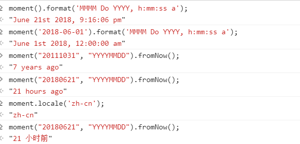
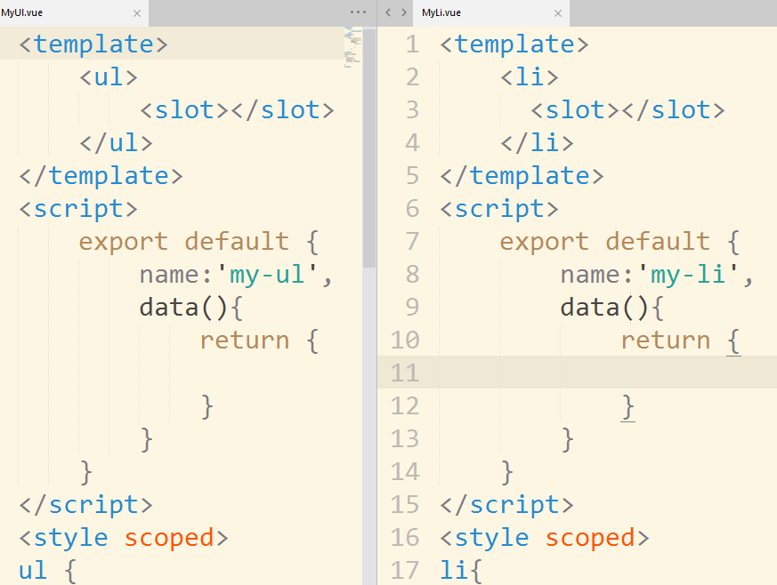
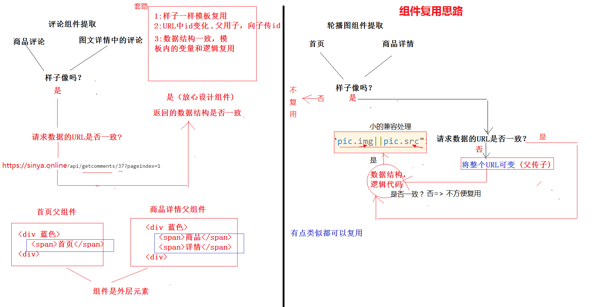

#### 今日难点

---



#### 生僻知识点

1. moment.js处理日期过滤 ``` moment(日期对象).format(’yyyy-mm-dd'); // xxxx-xx-xx```
2. vue-preview 图片预览插件  ```$preview.open(imgs,index); // 显示预览```
   * 难点: 图片的预览需要设置宽高(否则报错什么什么x)：``` imgs[index].w = 200; imgs[index].h = 200;```
3. mint-ui 图片懒加载 __lazy-load__
4. 全局过滤器的使用 ```Vue.filter('xxx',function(原数据) {   return '你要显示的数据'  });```
   * 调用方式 ```{{  '我是原数据' | xxx }}```
   * 也可以增加参数 ```xxx('prop1','prop2')```
5. 路由根据历史纪录返回 ```this.$router.go(-1);```

#### 难点

* 图文详情九宫格复用
  * 
  * 
* 评论组件的提取设计思路
  * 




#### 评论组件业务逻辑

* a. 首次加载获取第一页数据 ，典型代码 ```this.msg = res.data.message; // message为第1页数据```
* b. 点击加载更多追加后一页数据 ```this.msg = this.msg.concat(res.data.message); // message为第2页数据```
* c .发表评论获取第一页数据(单页应用无需重新刷新，而是在不刷新的情况下更改数据)
  * 1. 清空当前数据 ```this.msg = []```
    2. 调用第a条