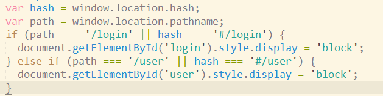
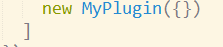
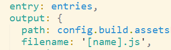

#### 自制webpack插件实现骨架屏

* 
* 原理分析：
  * 1: 从路由A跳到路由B慢不慢？  你敢说慢？ 因为A的时候各种js已经加载好了ok
  * 2: 那到底是什么比较慢 ？ A的首次加载
    * 慢会带来什么？
      * 1: 首屏白屏(量太大，渲染好久)
      * 2: 首屏卡顿(加载一半，一半卡住)
    * 解决方案：
      * 1: 客户端太慢，渲染容易卡住。。 服务端渲染好页面，客户端就加载个html完事
      * 2: 白屏也不错，但是如果能有个骨架屏，看起就爽了
* 插件实现思路
  * 
  * 需要在vue的执行代码加载之前，先让用户看到骨架屏，带app代码执行 new Vue() 替换<div id="app"></div> 就好了
  * 决定加载什么js的是index.html,操作他的插件是html-webpack-plugin
  * 我们让自己的插件再其后操作，并根据其留下的数据入口获取数据并更改
* 效果预览
  * html
    * 
  *  后续逻辑
    * 
  * 再来卡顿
    * 


* 插件代码

  * ```js
    let MyPlugin = function (options) {
      this.template = options.template;
    }
    
    MyPlugin.prototype.apply = function (compiler) {
      // console.log(compiler);
      console.log('我们的插件被执行了');
      // 先指定自己怎么编译，根据别人的编译结果操作
      compiler.plugin('compilation', compilation => {
          	// 别人编译的入口
              compilation.plugin('html-webpack-plugin-before-html-processing',(htmlData,callback) => {
                  // html-webpack-plugin中间插入行为的地方
                  htmlData.html = htmlData.html.replace(`<div id="app"></div>`,`
                    <div id="app">
                      <div style="background-color:red;height:300px;display:none;" id="default" >
                          我是默认的骨架屏
                      </div>
                      <div style="background-color:red;height:300px;display:none;" id="user" >
                          我是user的骨架屏
                      </div>
                      <div style="background-color:red;height:300px;display:none;" id="login" >
                          我是login的骨架屏
                      </div>
                    </div>
                    <script>
                          var hash = window.location.hash;
                          var path = window.location.pathname;
                          if (path === '/login' || hash === '#/login') {
                            document.getElementById('login').style.display = 'block';
                          } else if (path === '/user' || hash === '#/user') {
                            document.getElementById('user').style.display = 'block';
                          }
                    </script>
                    `);
                  // 不论如何两个参数，错误在前
                  callback(null,htmlData);
    
              });
    
      });
    }
    module.exports = MyPlugin;
    ```

  * 使用插件

    * 


#### 多页应用

* 核心思想: 其实就是两个vue项目，一次webpack打包，关联用url联系
  * webpack操作:
    * 1. 多个入口 {  main1:'./usermain.js',main2:'./goodsmain.js'  }
      2. 多个html插件

* 注意事项

  * 

* getHtmls的思路
  * 更为灵活的读取各项目下的js文件（入口）  entry:{‘js文件名’:'js文件路径' } 
  * 更为灵活的读取各项目下的html文件（首页.html） ``` plugins:[].concat(   [   new HtmlWebpackPlugin(),new HtmlWebpackPlugin()    ]    )```
    * filename属性是生成的相对dist的文件名  xxx.html
    * template 模板生成的参照物  需要绝对路径||相对路径 './xxx.html'
    * chunks:[filename]   指定第三引入的js文件名称
    * 
      * 这个[name]其实就是entry的key

* 部署: 解决首页: ```开发环境scripts的dev配置--open-page xxx.html   生产环境配置 server节点```

* ```js
  server {
          listen       9527;
          server_name  localhost;
        
        location / {
               root   html;
               index  user.index.html user.index.htm;
        }
      }
  ```


#### 处理前后端分离带来的跨域问题

* 开发环境 webpack.config.js(__dev__)

* ```js
   proxy: {
        '/api': {
          target: 'https://list.jd.com/list.html?cat=1318,1462,1480&callback=jQuery942326&md=9&l=jdlist&go=0',
          pathRewrite: {'^/api' : ''},
          changeOrigin:true, //必须要加，否则是访问自己
        	}
     }
   ```
  ```

* 生产环境 配置nginx.conf

* ```js
   location /api {
              # 这里也可以录用原有参数，进行复用，并重写URL
              proxy_pass https://list.jd.com/list.html?cat=1318,1462,1480&callback=jQuery942326&md=9&l=jdlist&go=0;
          }
  ```


#### 预渲染

* 单页应用..  首先加载index.html 
* 

* 再单页中预先渲染部分，静态数据，不变化的页面   关于我


#### 总结

* 骨架屏的webpack插件编写，apply函数可以参与webpack插件的执行
  * plugin('编译')
    * 操作文件 assers[''文件名'] = { source内容函数, size大小函数}
  * 介入其他插件留下的事件函数
  * webpack按顺序执行
* 多页应用
  * 多个单页应用
    * js入口多入口
    * html插件做多插件
      * 配置其不同的filename 和template属性
      * chunks 描述各自引入的资源
* 预渲染是再SPA中可以解决局部页面的SEO问题
  * 提前生成页面，URL匹配直接返回该页面
  * 生成about.html页面  该页面SEO 得到优化 /about
* 跨域
  * 开发 webpack proxy-middleware代理
  * 生产 nginx代理


#### 使用CachesAPI获取指定缓存的内容

- ```js
  caches.open('key').then(function(cachedRequests) { 
      cachedRequests.match('appshell').then(r => r.text() ).then(console.log);
    });
  ```


#### DB比较


#### PWA （渐进式/Web/application）

* 慢慢收服你
* 离线浏览web应用，生成桌面应用，顶部通知（页面都可以不存在），预缓存（在你页面没有启动以前，请求资源保存到浏览器）（真正访问的时候，非常快，请求本地），骨架屏，App shell(利用缓存机制保存css+html+js等等)， 分享，全屏图标
* 


* 以上所有讲的东西，请大家把自己当产品经理来学习，以后再新技术上，chrome推出PWA但是一直没火起来。
* 手机端 chrome 55以上才支持这些所有
  * IOS11 safari 支持
* 英文看支持率 caniuse     中文就是lavas官网可以看到

#### 服务端渲染

#### SSR（Server Site Render）
* nuxt.js

